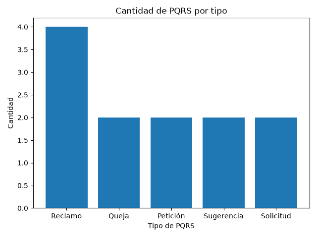

# Integración de IA para la Gestión de PQRS en Conjuntos Residenciales de Cartago, Valle del Cauca

## Problemática

Los administradores de conjuntos residenciales deben atender constantemente peticiones, quejas, reclamos y sugerencias (PQRS) presentadas por los residentes. La redacción de respuestas claras y apropiadas, la selección de formatos para cada caso y el seguimiento de las solicitudes pueden requerir mucho tiempo y generar dificultades en la gestión administrativa.

La plataforma Resuelve permite registrar y hacer seguimiento a las PQRS. Sin embargo, los administradores todavía deben analizar cada solicitud y preparar manualmente gran parte de las respuestas y comunicaciones.

La incorporación de inteligencia artificial en Resuelve permitirá ofrecer ideas de redacción, sugerir plantillas de respuesta y brindar apoyo durante la gestión de las PQRS. De esta manera, los administradores de conjuntos residenciales en Cartago, Valle del Cauca, podrán preparar respuestas con mayor agilidad, mantener una comunicación más clara y organizar mejor la atención de las solicitudes.

## Objetivo

Integrar un asistente de inteligencia artificial en la plataforma Resuelve que, a partir del contenido de cada PQRS, genere ideas de redacción, sugiera plantillas de respuesta y apoye al administrador durante el seguimiento de la solicitud, con el fin de agilizar su gestión y mejorar la claridad de las comunicaciones dirigidas a los residentes.

## Datos

Para este primer avance se utilizará un archivo CSV con datos sintéticos de PQRS. La plataforma Resuelve todavía no se encuentra implementada en conjuntos residenciales, por lo que actualmente no cuenta con registros operativos de usuarios.

El conjunto de datos representará solicitudes habituales presentadas por residentes y contendrá campos como:

- Número de radicado.
- Tipo de PQRS.
- Categoría de la solicitud.
- Estado.
- Numero de dias en los que se obtendrá una respuesta.
- Descripción de la solicitud.

El uso de datos sintéticos permite representar escenarios realistas, desarrollar el análisis inicial y proteger la información personal y confidencial de los residentes.

## Análisis exploratorio de datos

El programa carga los registros del archivo `data/pqrs.csv` como una lista de diccionarios. Posteriormente, utiliza NumPy para analizar la columna `dias_desde_radicacion` y calcular:

- Promedio.
- Valor máximo.
- Valor mínimo.
- Desviación estándar.

También utiliza Matplotlib para generar un gráfico de barras con la cantidad de PQRS registradas por cada tipo.

## Resultados

El análisis de los 12 registros sintéticos produjo los siguientes resultados:

- Promedio de días desde la radicación: 56.50 días.
- Máximo de días desde la radicación: 155 días.
- Mínimo de días desde la radicación: 2 días.
- Desviación estándar: 48.83 días.

## Hallazgos

1. El reclamo es el tipo de PQRS más frecuente, con 4 de los 12 registros analizados.
2. El 50 % de las PQRS se encuentra en estado radicada o en revisión, lo cual representa 6 solicitudes que todavía requieren gestión administrativa.

## Visualización

El siguiente gráfico presenta la cantidad de solicitudes registradas por cada tipo de PQRS:



La visualización permite identificar que los reclamos son el tipo de solicitud con mayor frecuencia dentro del conjunto de datos analizado.

## Requisitos

- Python 3.
- NumPy.
- Matplotlib.

Las librerías necesarias se encuentran registradas en `requirements.txt`.

## Ejecución

Desde la carpeta principal del proyecto, instalar las dependencias:

```bash
python -m pip install -r requirements.txt
```

Luego ejecutar el análisis:

```bash
python src/analisis_pqrs.py
```

## Estructura del proyecto

```text
ia-gestion-pqrs/
├── data/
│   └── pqrs.csv
├── src/
│   └── analisis_pqrs.py
├── .gitignore
├── grafico_pqrs.png
├── README.md
└── requirements.txt
```

## Tecnologías utilizadas

- Python 3.
- CSV para almacenar los datos sintéticos.
- NumPy para los cálculos estadísticos.
- Matplotlib para la visualización.
- Git y GitHub para el control de versiones.
- Visual Studio Code como entorno de desarrollo.

## Próximos pasos

En los siguientes avances se plantea integrar inteligencia artificial en Resuelve para:

- Generar ideas de redacción para las respuestas a las PQRS.
- Sugerir plantillas según el tipo de solicitud.
- Apoyar al administrador durante la gestión y seguimiento de cada caso.
- Evaluar las respuestas sugeridas antes de incorporarlas a la plataforma.

