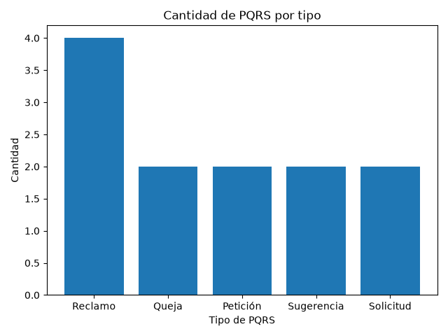
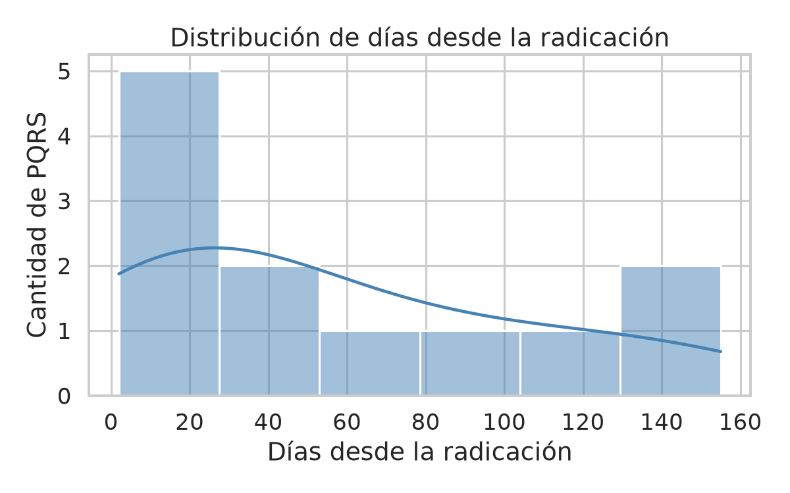
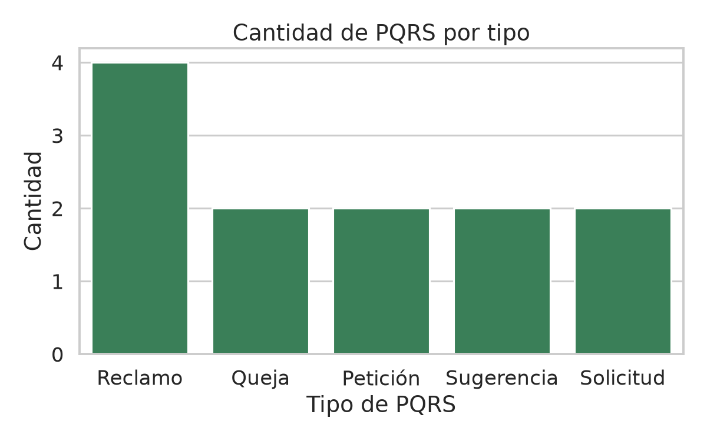
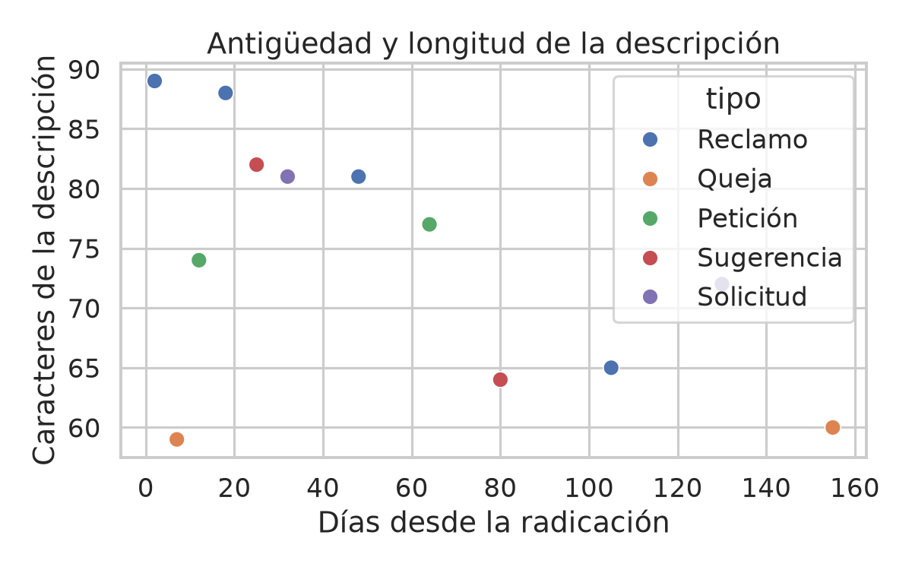
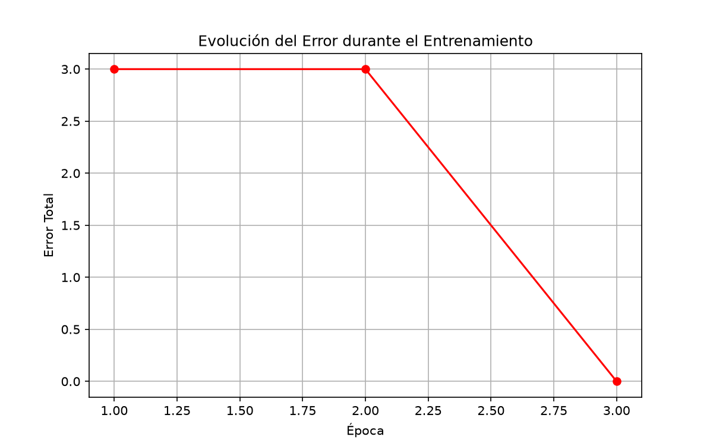
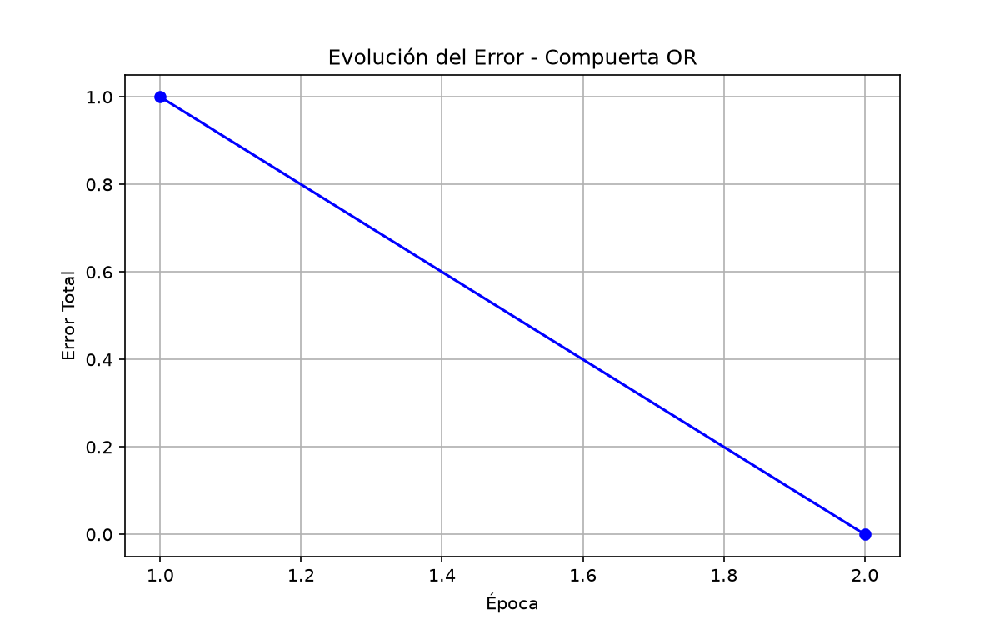
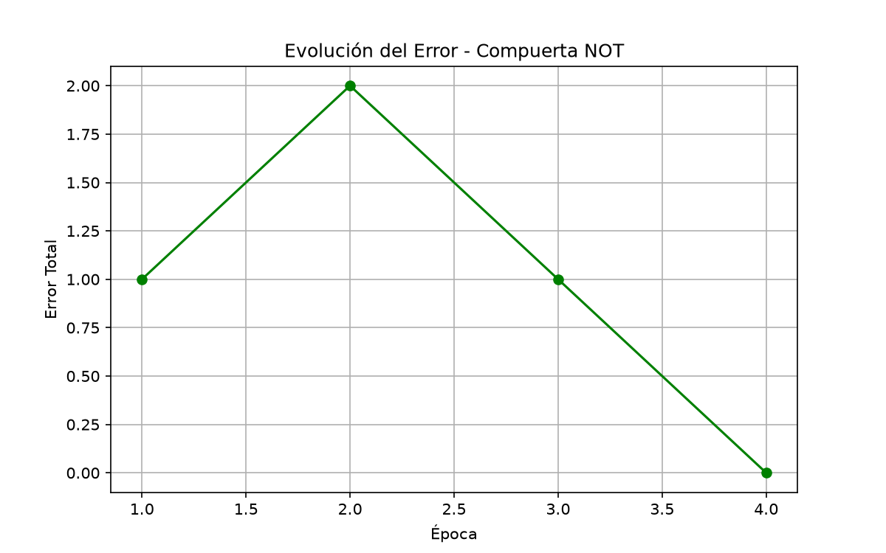

# Integración de IA para la Gestión de PQRS en Conjuntos Residenciales de Cartago, Valle del Cauca

## Problemática

Los administradores de conjuntos residenciales deben atender constantemente peticiones, quejas, reclamos y sugerencias (PQRS) presentadas por los residentes. La redacción de respuestas claras y apropiadas, la selección de formatos para cada caso y el seguimiento de las solicitudes pueden requerir mucho tiempo y generar dificultades en la gestión administrativa.

La plataforma Resuelve permite registrar y hacer seguimiento a las PQRS. Sin embargo, los administradores todavía deben analizar cada solicitud y preparar manualmente gran parte de las respuestas y comunicaciones.

La incorporación de inteligencia artificial en Resuelve permitirá ofrecer ideas de redacción, sugerir plantillas de respuesta y brindar apoyo durante la gestión de las PQRS. De esta manera, los administradores de conjuntos residenciales en Cartago, Valle del Cauca, podrán preparar respuestas con mayor agilidad, mantener una comunicación más clara y organizar mejor la atención de las solicitudes.

## Objetivo

Integrar un asistente de inteligencia artificial en la plataforma Resuelve que, a partir del contenido de cada PQRS, genere ideas de redacción, sugiera plantillas de respuesta y apoye al administrador durante el seguimiento de la solicitud, con el fin de agilizar su gestión y mejorar la claridad de las comunicaciones dirigidas a los residentes.

## Datos

Para este primer avance se utiliza un archivo CSV con 12 datos sintéticos, adaptados de los casos de demostración de Resuelve. La plataforma aún no está desplegada en conjuntos residenciales y, por tanto, no cuenta con registros operativos de residentes.

El conjunto de datos representará solicitudes habituales presentadas por residentes y contendrá campos como:

- Número de radicado.
- Asunto de la solicitud.
- Tipo de PQRS.
- Estado.
- Días transcurridos desde la radicación.
- Descripción de la solicitud.

El uso de datos sintéticos permite representar escenarios realistas, desarrollar el análisis inicial y proteger la información personal y confidencial de los residentes.

## Análisis exploratorio de datos

El programa carga los registros del archivo `data/pqrs.csv` como una lista de diccionarios. Posteriormente, utiliza NumPy para analizar la columna `dias_desde_radicacion` y calcular:

- Promedio.
- Valor máximo.
- Valor mínimo.
- Desviación estándar.

También utiliza Matplotlib para generar un gráfico de barras con la cantidad de PQRS registradas por cada tipo.

## Resultados

El análisis de los 12 registros sintéticos produjo los siguientes resultados:

- Promedio de días desde la radicación: 56.50 días.
- Máximo de días desde la radicación: 155 días.
- Mínimo de días desde la radicación: 2 días.
- Desviación estándar: 48.83 días.

## Hallazgos

1. El reclamo es el tipo de PQRS más frecuente, con 4 de los 12 registros analizados.
2. El 50 % de las PQRS se encuentra en estado radicada o en revisión, lo cual representa 6 solicitudes que todavía requieren gestión administrativa.

## Visualización

El siguiente gráfico presenta la cantidad de solicitudes registradas por cada tipo de PQRS:



La visualización permite identificar que los reclamos son el tipo de solicitud con mayor frecuencia dentro del conjunto de datos analizado.

## Requisitos

- Python 3.
- NumPy.
- Matplotlib.

Las librerías necesarias se encuentran registradas en `requirements.txt`.

## Ejecución

Desde la carpeta principal del proyecto, instalar las dependencias:

```bash
python -m pip install -r requirements.txt
```

Luego ejecutar el análisis:

```bash
python src/analisis_pqrs.py
```

## Estructura del proyecto

```text
ia-gestion-pqrs/
├── data/
│   └── pqrs.csv
├── src/
│   └── analisis_pqrs.py
├── .gitignore
├── grafico_pqrs.png
├── README.md
└── requirements.txt
```

## Tecnologías utilizadas

- Python 3.
- CSV para almacenar los datos sintéticos.
- NumPy para los cálculos estadísticos.
- Matplotlib para la visualización.
- Git y GitHub para el control de versiones.
- Visual Studio Code como entorno de desarrollo.

## Próximos pasos

En los siguientes avances se plantea integrar inteligencia artificial en Resuelve para:

- Generar ideas de redacción para las respuestas a las PQRS.
- Sugerir plantillas según el tipo de solicitud.
- Apoyar al administrador durante la gestión y seguimiento de cada caso.
- Evaluar las respuestas sugeridas antes de incorporarlas a la plataforma.

## Clase 7 - Preparación de Datos

Para la actividad independiente se utilizó el archivo `data/pqrs.csv`, compuesto por 12 registros sintéticos relacionados con la gestión de PQRS en conjuntos residenciales.

### Exploración con Pandas

El script `src/preparacion_pqrs.py` carga los datos con `pd.read_csv()` y muestra:

- Las primeras cinco filas con `df.head()`.
- La estructura y tipos de datos con `df.info()`.
- Las estadísticas descriptivas con `df.describe()`.
- Los valores nulos por columna con `df.isnull().sum()`.

El conjunto tiene 12 filas y 6 columnas. Se identificó que no existen valores nulos en ninguna de sus columnas.

### Limpieza y preparación

La columna `dias_desde_radicacion` se convierte a formato numérico. El código incluye un manejo condicional: si en futuros registros aparecen valores nulos en esta columna, se reemplazarán mediante la mediana. En los datos analizados no fue necesario aplicar esa imputación.

Las variables categóricas `tipo` y `estado` se codificaron con One-Hot Encoding mediante `pd.get_dummies()`. Esto crea columnas numéricas que pueden usarse en un futuro modelo de aprendizaje automático.

También se creó la columna derivada `longitud_descripcion`, que cuenta los caracteres de la descripción de cada PQRS. Esta variable permite explorar si la extensión del texto presenta alguna relación con la antigüedad de la solicitud.

El resultado se guarda en `data/pqrs_preparadas_ml.csv`. Esta copia contiene datos numéricos preparados para un futuro ejercicio de Machine Learning; todavía no se entrena un modelo, ya que el conjunto tiene únicamente 12 registros sintéticos.

### Visualizaciones con Seaborn

#### Distribución de días desde la radicación



Cinco de las doce PQRS tienen entre 2 y 25 días desde su radicación. Sin embargo, existen solicitudes con 130 y 155 días, lo cual muestra diferencias importantes en la antigüedad de los casos y la necesidad de hacer seguimiento.

#### Cantidad de PQRS por tipo



Los reclamos son el tipo más frecuente, con 4 de 12 registros (33,3 %). En este conjunto sintético, este hallazgo puede orientar la creación futura de plantillas e ideas de redacción para reclamos.

#### Antigüedad y longitud de la descripción



No se observa una relación directa entre los días desde la radicación y la longitud de la descripción. Por ello, una futura solución de IA debería considerar principalmente el contenido y tipo de la PQRS, no solamente su antigüedad.

## Clase 8 - Neurona Artificial y Compuertas Lógicas

En esta actividad se implementó una neurona artificial o perceptrón simple en Python. La neurona calcula una suma ponderada de las entradas y aplica una función escalón para producir una salida de 0 o 1.

Primero se implementó la compuerta AND en `src/neurona_and.py`. Con los parámetros iniciales `w1 = 0.1`, `w2 = 0.1` y `b = 0.0`, la neurona redujo su error hasta cero y aprendió la compuerta en 3 épocas.



También se implementaron las compuertas OR y NOT en `src/neuronas_logicas.py`.

- La compuerta OR aprendió en 2 épocas.
- La compuerta NOT aprendió en 4 épocas.
- En los tres casos se utilizó una tasa de aprendizaje de 0.1; no fue necesario modificarla porque el error llegó a cero.





La diferencia principal entre AND y OR está en su salida esperada. AND solo devuelve 1 cuando ambas entradas son 1; OR devuelve 1 cuando al menos una entrada es 1.

La compuerta XOR no puede ser aprendida por una sola neurona o perceptrón simple porque sus resultados no son separables mediante una sola frontera de decisión lineal. Para aprender XOR se requiere una red con más de una neurona, por ejemplo una capa oculta.